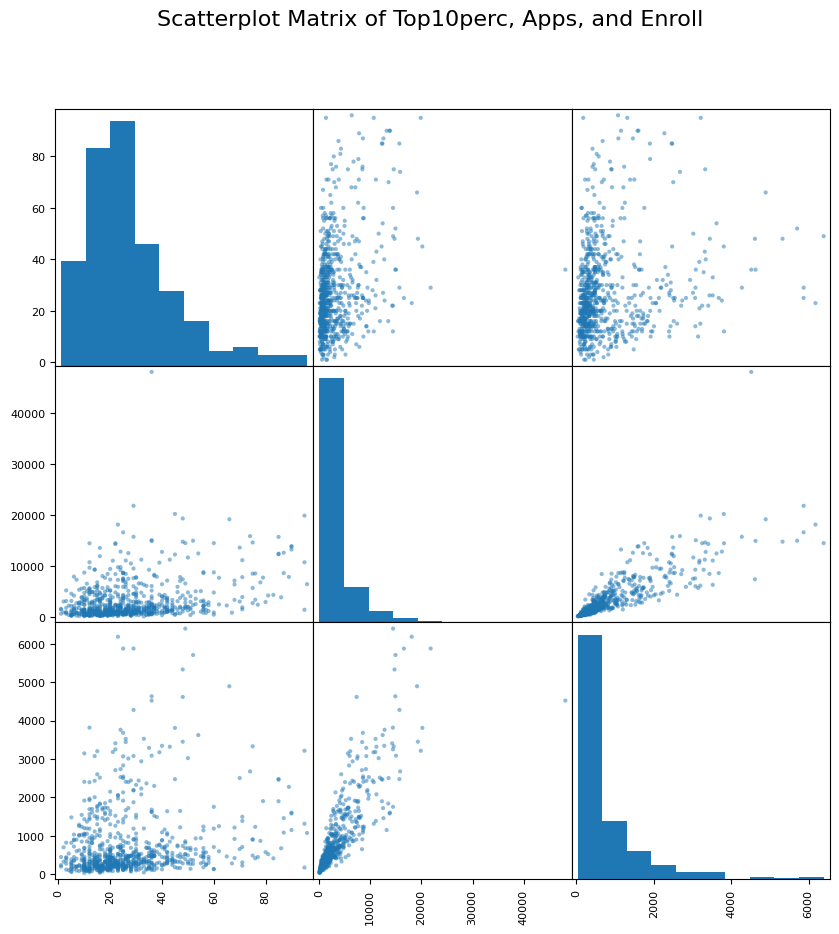

# ISLP Book Exercises 📚🤖

<!-- PROJECT LOGO -->
 

  

    Department of Bioinformatics, IBB, University of Tehran
     
  

  

Welcome to the ISLP Book Exercises Machine Learning repository! 🌟 Here, you'll find solutions and discussions for exercises from the "ISLP" book, with a focus on machine learning concepts. Dive into the world of statistics and learn how it intersects with the exciting field of machine learning.

## Structure 🏗️
The repository is organized by chapters, and each chapter contains exercises and their corresponding solutions. Feel free to explore, learn, and contribute to this collaborative learning space.

## Table of Contents 📖
- [Chapter 2: Statistical Learning(8 and 10)](#)

## Languages Used

Python 

(<a href="#readme-top">back to top</a>)

<!-- CONTACT -->
## Contact

Fereshteh Noroozi - @LinkedIn 

(<a href="#readme-top">back to top</a>)

Happy learning! 🚀
